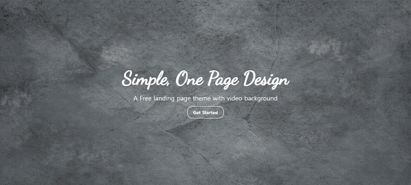

# Full-Screen-Landing-Page


## 효과 
풀스크린 랜딩 페이지   

## 학습  
### 1. CSS : `<a>`태그 vs `<button>`태그  
`<a>`태그 | `<button>`태그     
---|---|
링크 연결| type :"button" 단순 클릭 이벤트
target 속성으로 이동 방법 지정 | type :"submit" form의 데이터 전송
페이지 이동 및 페이지 내의 이동 | type :"reset" form 데이터 리셋
의사클래스 사용 가능 (:link, :visited, :hover, :active, :focus) | 의사클래스 사용 제한 (:hover, :active, :focus만 사용 가능)
엔터키 누르면 클릭할 수 있음 | 엔터키나 스페이스바 누르면 클릭할 수 있음
스크린리더 사용자에게 다른 페이지나 섹션으로 이동 | 스크린리더 사용자에게 동적인 부분 구현, click이라고 말하면 작동

### 2. CSS : 단위 

**2.1 절대 단위와 상대 단위** 
절대단위 | 상대단위 
---|---|
in, cm, mm, pt, px |  %, em, rem, vh, vw 
출력장치(모니터)의 물리적 속성을 아는 경우 효율적 | 기종간, 플랫폼 간의 호환성을 유지하는데 유리 (반응형 만들때)

**2.2 절대단위**   
- **px**   
  : px은 픽셀(화소) 단위이다. 1px은 화소 1개 크기를 의미.   
  : px은 요소의 크기나 이미지의 크기 지정에 주로 사용.  

**2.3 상대단위**   
- **%**  
  : 부모 엘리먼트의 size를 기준으로 한 상대적인 size  
  ```
  <div id="parent>
    <div id="child"></div>
  </div>
  ```
  ```
  #parent {
    width : 100%; 
    height : 200px;  
  }

  #child {
    width : 100%;
    height : 100%;  // 부모 크기 200px을 그대로 따라감
  }
  ```

  : %를 기준으로 max-width, min-width 를 설정할 수 있다. 
  
  ```
    #parent {
    width : 200px; 
    height : 200px;

    max-width : 90%; 
    min-width : 50%; 
  }
  ```
  부모 사이즈(여기서는 브라우저 크기)를    
  줄일 경우 : max-width: 90%를 맞추기 위해 박스 사이즈가 200px이하로 줄어듬     
  늘릴 경우 : min-width 50%를 맞추기 위해 width가 200px이상으로 늘어남  

- **em**     
  : 부모 엘리먼트 font-size를 기준으로 한 상대적인 size  
  > 예를 들어, font-size: 16px인 경우   
  상대 단위는 브라우저에 의해서 다음과 같이 계산된다.

  ```  0.5em = 16 px x 0.5 = 8px
    1em = 16 px x 1 = 16px
    2em = 16 px x 2 = 32px
    3em = 16 px x 3 = 48px
  ```
  : 중첩된 자식 요소에 em을 지정하면 모든 자식 요소의 사이즈에 영향을 미치기 때문에 주의

- **rem**     
  : rem = root em의 약자   
  : root는 최상위 요소인 html을 의미.   
  : root 요소(html)의 font-size과 비교하여 size를 계산.  
  : html의 기본 font-size는 16px   
  ```
  <div id="parent>
    <div id="header">
      <div id=""content1></div>
      <div id=""content2></div>
    </div>
  </div>
  ```
  ```
  #header {
    font-size : 32px;
  }

  #content1 {
    width : 10em; // 320px
  }

  #content2 {
    width : 10rem; // 160px
  }  
  ```
  중간에 header div의 font-size를 32px로 바꿀경우      
  content1 div는 32px x 10em = 320px이 되지만      
  content2 div는 root의 16px x 10rem으로 160px을 유지    
 
- **Viewport 단위(vh, vw, vmin, vmax)**     
  : Viewport 단위는 상대적인 단위로 viewport를 기준으로 한 상대적 사이즈를 의미     
  단위 | 설명    
  ---|---|  
  vw | viewport 너비의 1/100    
  vh | viewport 높이의 1/100   
  vmin | viewport 너비 또는 높이 중 작은 쪽의 1/100    
  vmax | viewport 너비 또는 높이 중 큰 쪽의 1/100       
  
  : 예) viewport 너비가 1000px, 높이가 600px인 경우,

  ```    
    1vw : 10px // viewport 너비 1000px의 1% (1/100) 
    1vh : 6px // viewport 높이 600px의 1% (1/100) 
    vmin : 6px // viewport 높이 600px의 1% (1/100) 
    vmax : 10px // viewport 너비 1000px의 1% (1/100) 
  ```

  : 풀스크린의 배경이미지와 섹션 전체 화면으로 표시되는 요소에 배경 이미지를 설정하는 경우가 많다. 제품이나 서비스에 대한 개별 섹션이 화면 가득 표시되도록 Web 사이트를 디자인하고 싶은 경우가 있을 때 각 요소의 폭을 100 %로 높이를 100vh에 설정할 수 있다.      
  ```
  #main {
    background: url(image/bg-gray.jpg) no-repeat;
    background-size: cover;
    background-position: center center;
    width: 100vw;
    height: 100vh;
  }
  ```
  :Viewport 단위는 사용자 화면의 중앙에 요소를 정확하게 배치 할 필요가있는 경우에 매우 유용하다. 요소의 높이를 알고 있으면 margin 속성에서 top과 bottom의 값을 (100 - height) / 2] vh로 설정하면 볼 수 있다.
 

## 학습 출처 
**유튜브**   
https://www.youtube.com/@sucoding   

**CSS**   
https://velog.io/@eun0leee/HTML-a%ED%83%9C%EA%B7%B8%EC%99%80-button%ED%83%9C%EA%B7%B8%EC%9D%98-%EC%B0%A8%EC%9D%B4     
https://kindloveit.tistory.com/35   
https://poiemaweb.com/css3-units   


**키워드**    
`<a>`태그    
`<button>`태그   
CSS 단위(px, %, em, rem, viewport단위)   
